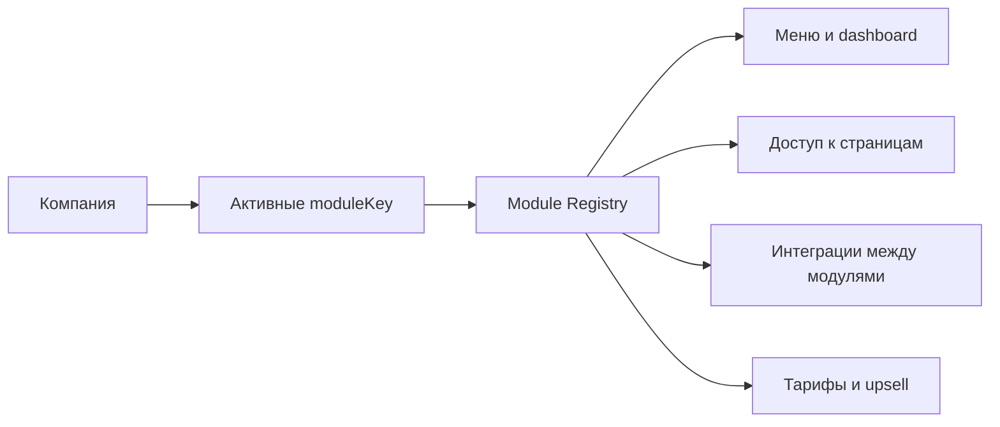

# BuildFlow ERP — аудит модульной архитектуры

Дата аудита: 2026-06-05

## Краткий вывод

Проект уже близок к платформе, но модули пока разделены в основном визуально и по URL. Реальные доменные границы смешаны:

- финансы строительства живут внутри `/construction`;
- продажи юнитов и шахматка живут внутри строительства, хотя CRM тоже имеет сделки и договоры;
- снабжение частично автономно (`/warehouse`, `/supply`), но задачи строительства напрямую создают и читают заявки снабжения;
- инвесторы технически находятся в аренде;
- клиентский сервис правильно вынесен в CRM, но портальные сущности еще не оформлены как отдельный contract между CRM и порталами.

Главная рекомендация: не делать резкое переименование всех routes. Сначала вводится Module Registry, затем каждый экран и API постепенно переводится на правила registry, permissions и feature flags.

## Текущая карта модулей

| UI-модуль сейчас | Целевой канонический модуль | Основные routes | Основные сущности |
| --- | --- | --- | --- |
| `consolidated` | `core` | `/dashboard`, `/settings`, `/users`, `/counterparties`, `/reports` | company, user, role, counterparty, notification |
| `construction` | `construction` + частично `finance` | `/construction/projects`, `/construction/stages`, `/construction/tasks`, `/construction/chess`, `/construction/contracts-sales`, `/construction/accruals`, `/construction/payroll` | project, stage, task, unit, salesContract, accrual, payrollEmployee |
| `warehouse` | `procurement` | `/warehouse/*`, `/supply/requests` | supplyRequest, purchaseOrder, supplier, item, stockMovement |
| `proptech` | `crm` | `/crm/leads`, `/crm/clients`, `/crm/deals`, `/crm/client-relations` | lead, client, deal, clientAnnouncement, clientPortal |
| `rental` | `rent` + частично `investors` | `/rental/properties`, `/rental/contracts`, `/rental/payments`, `/rental/investors` | rentalProperty, tenant, lease, rentPayment, investor |

## Целевая карта модулей

| Модуль | Может продаваться отдельно | Что должно работать автономно |
| --- | --- | --- |
| `construction` | Да | Проекты, этапы, задачи, подрядчики, стройконтроль |
| `finance` | Да | Приходы, расходы, счета, бюджеты, ОДДС, ОПУ, задолженности, платежный календарь |
| `procurement` | Да | Заявки, согласования, поставщики, заказы, склад, маркетплейс |
| `crm` | Да, но ценность выше вместе со строительством | Лиды, клиенты, сделки, объявления, клиентский сервис |
| `rent` | Да | Объекты аренды, арендаторы, договоры, начисления, платежи |
| `investors` | Дополнительный модуль | Инвесторы, вложения, распределения, доходность |
| `core` | Нет, это обязательное ядро | Компания, пользователи, роли, настройки, справочники |

## Обнаруженные жесткие связи

1. `construction -> procurement`
   - `artifacts/proptech/src/pages/construction/tasks.tsx` читает `/supply/requests`.
   - Там же есть создание заявки снабжения из задачи.
   - Должно быть скрыто, если `procurement` не активен.

2. `construction approvals -> procurement`
   - `artifacts/proptech/src/pages/construction/planning/approvals.tsx` работает с `/supply/requests`.
   - Это должен быть integration screen, доступный только при `construction + procurement`.

3. `construction -> finance`
   - `/construction/operations`, `/construction/accounts`, `/construction/accruals`, `/construction/cashier`, `/construction/reconciliation`, `/construction/analytics/*`, `/construction/payroll`.
   - Сейчас это часть строительства, но целевой SaaS должен уметь продавать `finance` отдельно.

4. `crm -> construction`
   - CRM-продажи и строительная шахматка пересекаются по юнитам, цене, договору и клиенту.
   - Нужен integration contract: CRM не должна напрямую зависеть от внутренних экранов строительства.

5. `rent -> investors`
   - Инвесторы живут в `/rental/investors`.
   - В целевой модели это отдельный add-on, который включается поверх аренды/финансов.

6. `portal -> warehouse/rent/investors`
   - `artifacts/api-server/src/routes/portal.ts` обслуживает разные порталы в одном route.
   - Позже нужно разделить portal adapters по модулям.

## Реализованный первый слой

Добавлен frontend registry:

- `artifacts/proptech/src/lib/module-registry.ts`
- описывает текущие UI-модули, канонические модули, route prefixes, dashboard tabs, owned entities и integration contracts;
- заменяет локальный маппинг `/modules/enabled` в `use-module-access`.

Добавлен API registry:

- `artifacts/api-server/src/lib/module-registry.ts`
- централизует `AVAILABLE_MODULES`, signup mapping, fallback enabled modules и integration contracts;
- `artifacts/api-server/src/routes/modules.ts` теперь использует registry вместо локальных массивов.

## Tenant Feature Flags

Текущая таблица:

- `moduleSettingsTable`
- хранит `companyId`, `moduleKey`, `isEnabled`, `enabledAt`.

Целевая логика:

Правило: если модуль выключен, он не должен появляться в меню, dashboard, быстрых действиях, кнопках создания и API-действиях.

## Integration contracts

| Интеграция | Требует | Поведение |
| --- | --- | --- |
| `construction.finance` | construction + finance | бюджеты, начисления, платежи, ОДДС/ОПУ |
| `construction.procurement` | construction + procurement | заявка снабжения из задачи/этапа |
| `crm.construction` | crm + construction | продажа юнитов из шахматки по утвержденным ценам |
| `rent.finance` | rent + finance | арендные платежи в общей финаналитике |
| `procurement.finance` | procurement + finance | оплаты поставщикам как расходы |
| `investors.rent` | investors + rent | доходность и распределения по арендным объектам |

## План миграции без поломки

1. Registry-first
   - Все меню, dashboard tabs, help, быстрые действия и registration должны читать правила из registry.
   - Уже начато.

2. Route guards
   - Добавить frontend helper `canUseIntegration(...)`.
   - Скрыть кнопки и query к чужим модулям, если integration выключена.

3. API guards
   - Добавить middleware `requireModule(moduleKey)` и `requireIntegration(integrationKey)`.
   - Применять постепенно: сначала новые endpoints, затем рискованные старые.

4. Finance extraction
   - Создать канонический finance namespace без немедленного удаления старых `/construction/*`.
   - Старые routes оставить как alias/compatibility layer.

5. Procurement extraction
   - Убрать прямые вызовы `/supply/requests` из construction UI.
   - Ввести service layer: `createProcurementRequestFromTask`.

6. CRM/client portal boundary
   - Клиентский сервис оставить только в CRM.
   - Портал контрагентов должен получать данные через portal API adapters, а не напрямую из CRM/Construction/Rent.

7. Billing
   - Связать module settings с тарифами: отдельные модули, пакеты и upsell.

## SaaS-монетизация

Рекомендуемая упаковка:

- `Стройка Start`: construction.
- `Финансы`: finance.
- `Снабжение`: procurement.
- `Аренда`: rent.
- `CRM + клиентский сервис`: crm.
- `ERP Suite`: construction + finance + procurement + crm + rent.
- Add-ons: investors, AI tools, marketplace, advanced analytics, portal branding.

Модель продаж:

- базовая цена за компанию;
- цена за активный модуль;
- лимит пользователей/объектов/юнитов;
- платные add-ons для автоматизации и AI;
- скидка за пакет из 3+ модулей.

## Следующие технические шаги

1. Перевести `layout.tsx` и `dashboard-access.ts` на `MODULE_REGISTRY`.
2. Добавить `canUseIntegration` в UI и скрыть supply-действия в строительных задачах без `warehouse`.
3. Добавить API middleware `requireEnabledModule`.
4. Разделить finance как логический модуль в navigation и permissions, не меняя сразу старые URL.
5. Добавить e2e smoke по сценариям: only rental, only warehouse, construction + warehouse, full suite.
